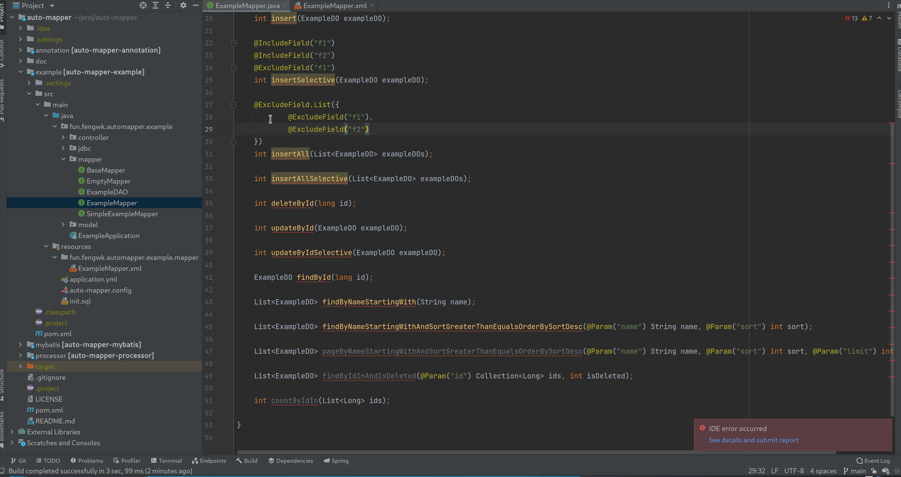

# AutoMapper

AutoMapper是一款适用于Mybatis的SQL生成插件，提供了JPA风格的SQL语句生成能力，用户仅需依赖一个编译期jar包，就能在编译期根据Mapper接口中的方法定义生成相应的XML文件和SQL语句。就像流行的Lombok一样，一切发生在编译期间，因此不会对软件性能造成任何影响，并且用户可以直接在编译完成的target目录或jar中看到生成的SQL语句。

# 效果展示

下方动图演示了在idea上插件在编译时动态生成SQL的效果，您可以通过Build -> ReBuild Project达到一样的效果。



无论您使用的是什么开发环境，只要编译器是按照标准实现的，都能生成成功。另外在打包发布时，这个过程是无感的，因为在打包编译的过程中AutoMapper会自动生效。

# 快速开始

首先需要在项目的编译阶段依赖AutoMapper，如果您正在使用maven管理项目，那么添加如下依赖即可：

```xml
<dependency>
    <groupId>fun.fengwk.auto-mapper</groupId>
    <artifactId>auto-mapper-processor</artifactId>
    <scope>provided</scope>
    <version>0.0.27</version>
</dependency>
```

常见的Mybatis使用方式是编写一个`*Mapper.java`文件在其中定义接口方法，然后编写一个`*Mapper.xml`文件实现接口方法的SQL语句。例如example模块中（tips：example模块中展示了如何在spring-boot项目里使用AutoMapper）就有`ExampleMapper.java`文件和`ExampleMapper.xml`文件，但只要在`ExampleMapper`类上标记`@AutoMapper`注解，AutoMapper就可以在编译期间帮助您生成相应符合规范的Mybatis SQL片段语句到相同包路径下的xml文件中（如果已经手动编写了相应方法定义的SQL，那么框架会跳过该方法的自动生成工作）。

```java
@AutoMapper
public interface ExampleMapper {
    
    ExampleDO findById(long id);
    
}
```

例如定义了如上的`ExampleMapper`类，那么框架会自动生成如下的Mybatis SQL片段并插入与`ExampleMapper`类相同包路径下的名称为`ExampleMapper.xml`文件中，如果不存在`ExampleMapper.xml`文件那么AutoMapper将会自动生成一个。

```xml
<!--auto mapper generate-->
<select id="findById" parameterType="long" resultType="fun.fengwk.automapper.example.model.ExampleDO">
    select id, name, sort
    from example
    where id=#{id}
</select>
```

# 语法约定

为了实现SQL生成，必须遵循一定规则来定义Mapper接口的方法，如果您曾使用过JPA，那么这些规则会非常容易理解，因为这些规则几乎完全遵循了JPA的约定。

下标站时刻展示了当前支持的所有模式（如果您了解状态机可以直接查看`doc/MapperMethodStateMachine.drawio`）：

| 描述 | 模式                    | 约束                                                                                                                                                                                                                      |
| ---- | ----------------------- | ------------------------------------------------------------------------------------------------------------------------------------------------------------------------------------------------------------------------- |
| 新增 | insert[Selective]       | 单个JavaBean入参                                                                                                                                                                                                          |
|      | insertAll[Selective]    | 可迭代的JavaBean入参，如果在该场景下使用了Selective，则需要在jdbc参数中追加`allowMultiQueries=true`，并且UseGeneratedKeys会失效（确切的来说只会返回第一个SQL的自增键，这是由jdbc的特性决定的，详见JdbcGeneratedKeysTest）|
| 删除 | deleteAll               | 无入参                                                                                                                                                                                                                    |
|      | deleteBy...             | 多入参数时必须使用@Param注解绑定By后参数与入参关系                                                                                                                                                                        |
| 修改 | updateBy...[Selectivce] | 多入参数时必须使用@Param注解绑定By后参数与入参关系                                                                                                                                                                        |
| 查询 | findAll[OrderBy...]     | 无入参                                                                                                                                                                                                                    |
|      | findBy...[OrderBy...]   | 多入参数时必须使用@Param注解绑定By后参数与入参关系                                                                                                                                                                        |
| 计数 | countAll                | 无入参                                                                                                                                                                                                                    |
|      | countBy...              | 多入参数时必须使用@Param注解绑定By后参数与入参关系                                                                                                                                                                        |
| 分页 | pageAll[OrderBy...]     | 入参必须拥有limit，可选offset，必须使用@Param注解绑定By后参数与入参关系                                                                                                                                                   |
|      | pageBy...[OrderBy...]   | 入参必须拥有limit，可选offset，必须使用@Param注解绑定By后参数与入参关系                                                                                                                                                   |
|      | limitAll[OrderBy...]    | 入参必须拥有limit，可选offset，必须使用@Param注解绑定By后参数与入参关系                                                                                                                                                   |
|      | limitBy...[OrderBy...]  | 入参必须拥有limit，可选offset，必须使用@Param注解绑定By后参数与入参关系                                                                                                                                                   |

下表格展示了当前支持的所有关键字：

| 关键字             | 方法名                                 | SQL                                          |
| ------------------ | -------------------------------------- | -------------------------------------------- |
| And                | findByLastnameAndFirstname             | ... where x.lastname = ? and x.firstname = ? |
| Or                 | findByLastnameOrFirstname              | ... where x.lastname = ? or x.firstname = ?  |
| Is，Equals         | findById，findByIdIs，findByIdEquals   | ... where x.id = ?                           |
| LessThan           | findByAgeLessThan                      | ... where x.age < ?                          |
| LessThanEquals     | findByAgeLessThanEquals                | ... where x.age <= ?                         |
| GreaterThan        | findByAgeGreaterThan                   | ... where x.age > ?                          |
| GreaterThanEquals  | findByAgeGreaterThanEquals             | ... where x.age >= ?                         |
| After              | findByIdAfter                          | ... where x.id > ?                           |
| Before             | findByIdBefore                         | ... where x.id < ?                           |
| IsNull             | findByNameIsNull                       | ... where x.name is null                     |
| IsNotNull，NotNull | findByNameIsNotNull，findByNameNotNull | ... where x.name is not null                 |
| Like               | findByNameLike                         | ... where x.name like ?                      |
| NotLike            | findByNameNotLike                      | ... where x.name not like ?                  |
| StartingWith       | findByNameStartingWith                 | ... where x.name not like '?%'               |
| EndingWith         | findByNameEndingWith                   | ... where x.name not like '%?'               |
| Containing         | findByNameContaining                   | ... where x.name not like '%?%'              |
| OrderBy            | findByIdOrderByIdDesc                  | ... where x.id = 1 order by x.id desc        |
| Not                | findByNameNot                          | ... where x.name != ?                        |
| In                 | findByIdIn(Collection)                 | ... where x.id in (...)                      |
| NotIn              | findByIdNotIn(Collection)              | ... where x.id not in (...)                  |

# 注解支持

支持自定义字段名：可以在入参或字段上添加`@FieldName`注解支持自定义数据库字段名称。

支持useGeneratedKeys：可以在字段上添加`@UseGeneratedKeys`注解支持Mybatis的useGeneratedKeys功能。

使用`@ExcludeField`可以忽略insert或update方法中的指定字段。

使用`@IncludeField`可以只指定insert或update方法中的指定字段。

使用`@Selective`可以指明where查询字段是否为可选的。

使用`@DynamicOrderBy`可以指明动态排序字段。

# 全局配置

尽管我们可以在`@AutoMapper`注解中修改当前类的配置，但如果需要进行全局配置，可以在resource根目录下定义`auto-mapper.config`文件作为全局配置，优先级为：用户明确指定的注解配置 > 全局配置 > 默认配置。

```properties
fun.fengwk.automapper.annotation.AutoMapper.dbType=MYSQL
fun.fengwk.automapper.annotation.AutoMapper.mapperSuffix=Mapper
fun.fengwk.automapper.annotation.AutoMapper.tableNamingStyle=LOWER_UNDER_SCORE_CASE
fun.fengwk.automapper.annotation.AutoMapper.fieldNamingStyle=LOWER_UNDER_SCORE_CASE
fun.fengwk.automapper.annotation.AutoMapper.tableNamePrefix=test_
fun.fengwk.automapper.annotation.AutoMapper.tableNameSuffix=_test
```

# 编译信息

AutoMapper在编译期会打印这以下几种常见信息：

- 映射完成写入目标xml文件。
- 用户已经编写过要映射的方法的sql片段，AutoMapper将跳过这一方法的处理。
- 用户没有编写过要映射的方法并且自动映射失败，此时会报告错误并中断编译，此时用户需要确认是否需要使用AutoMapper映射此方法，如果需要则需修正方法语法，否则可以自行在xml文件中定义相应方法对应的sql片段。

# MySQL特性

当在`@AutoMapper`注解或全局配置中指定了dbType为MYSQL时可以使用一些特有的语法：

- 使用`insertIgnore`代替`insert`可使用`insert ignore into`语法。
- 使用`replace`代替`insert`可使用`replace into`语法。
- 使用`insertOnDuplicateKeyUpdate`可使用`insert into ... on duplicate key update ...`语法。
- 使用`findLockInShareMode`代替`find`可使用`select ... lock in share mode`语法。
- 使用`findForUpdate`代替`find`可使用`select ... for update`语法。
- 对于like语句，将使用concat拼接防止SQL注入。

# 应用示例

下面将会展示一些具体的示例（这些示例均来自于example模块，可以结合具体代码理解）帮助您了解如何使用规则定义接口方法。

## 示例一

方法

```java
int insert(ExampleDO exampleDO);
```

SQL片段

```xml
<!--auto mapper generate-->
<insert id="insert" keyProperty="id" parameterType="fun.fengwk.automapper.example.model.ExampleDO" useGeneratedKeys="true">
    insert into example (name, sort) values
    (#{name}, #{sort})
</insert>
```

说明

其中name和sort是通过读取ExampleDO中字段获取的，并且Java字段名称会通过@AutoMapper中定义中fieldNamingStyle转换为相应的数据库字段格式，如果没有办法通过常规的规则转换，也可以通过@FieldName注解直接指定数据库字段名称，如果使用了自增主键，使用@UseGeneratedKeys注解可以对相应字段开启Mybatis的useGeneratedKeys属性并且在insert语句中忽略该字段的插入。

## 示例二

方法

```java
int deleteById(long id);
```

SQL片段

```xml
<!--auto mapper generate-->
<delete id="deleteById" parameterType="long">
    delete from example
    where id=#{id}
</delete>
```

说明

AutoMapper根据By后条件生成where语句，因为只有一个参数不必添加`@Param`注解来说明参数名称。

## 示例三

方法

```java
int updateById(ExampleDO exampleDO);
```

SQL片段

```xml
<!--auto mapper generate-->
<update id="updateById" parameterType="fun.fengwk.automapper.example.model.ExampleDO">
    update example set id=#{id}, name=#{name}, sort=#{sort}
    where id=#{id}
</update>
```

说明

AutoMapper通过读取入参ExampleDO类的字段生成set语句，并且根据By后条件生成where语句。

## 示例四

方法

```java
ExampleDO findById(long id);
```

SQL片段

```xml
<!--auto mapper generate-->
<select id="findById" parameterType="long" resultType="fun.fengwk.automapper.example.model.ExampleDO">
    select id, name, sort
    from example
    where id=#{id}
</select>
```

说明

AutoMapper通过读取返回值ExampleDO类中的字段生成select语句，并且根据By后条件生成where语句，因为只有一个参数不必添加`@Param`注解来说明参数名称。

## 示例五

方法

```java
List<ExampleDO> findByNameStartingWith(String name);
```

SQL片段

```xml
<!--auto mapper generate-->
<select id="findByNameStartingWith" parameterType="java.lang.String" resultType="fun.fengwk.automapper.example.model.ExampleDO">
    select id, name, sort
    from example
    where name like concat(#{name}, '%')
</select>
```

说明

AutoMapper通过读取返回值泛型ExampleDO类中的字段生成select语句，根据By后条件生成where语句，因为只有一个参数不必添加`@Param`注解来说明参数名称。

## 示例六

方法

```java
List<ExampleDO> findByNameStartingWithAndSortGreaterThanEqualsOrderBySortDesc(@Param("name") String name, @Param("sort") int sort);
```

SQL片段

```xml
<!--auto mapper generate-->
<select id="findByNameStartingWithAndSortGreaterThanEqualsOrderBySortDesc" resultType="fun.fengwk.automapper.example.model.ExampleDO">
    select id, name, sort
    from example
    where name like concat(#{name}, '%')
    and sort&gt;=#{sort}
    order by sort desc
</select>
```

说明

AutoMapper通过读取返回值泛型ExampleDO类中的字段生成select语句，根据By后条件生成where语句，因为只有多个参数必须添加`@Param`注解来说明参数名称。

## 示例七

方法

```java
List<E> pageAll(@Param("offset") int offset, @Param("limit") int limit);
```

SQL片段

```xml
<!--auto mapper generate-->
<select id="pageAll" resultType="fun.fengwk.automapper.example.model.ExampleDO">
    select id, name, sort
    from example
    limit #{offset},#{limit}
</select>
```

说明

AutoMapper解析父类泛型E得到ExampleDO，继而读取ExampleDO字段生成select语句，由于是page方法，必须添加offset和limit参数。

## 示例八

方法

```java
@ExcludeField("name")
int insert(ExampleDO exampleDO);
```

SQL片段

```xml
<!--auto mapper generate-->
<insert id="insert" keyProperty="id" parameterType="fun.fengwk.automapper.example.model.ExampleDO" useGeneratedKeys="true">
    insert into example (sort) values
    (#{sort})
</insert>
```

说明

使用`@ExcludeField`注解可以去除insert和update语句中不需要的字段。

## 示例九

方法

```java
@IncludeField("name")
int insert(ExampleDO exampleDO);
```

SQL片段

```xml
<!--auto mapper generate-->
<insert id="insert" keyProperty="id" parameterType="fun.fengwk.automapper.example.model.ExampleDO" useGeneratedKeys="true">
    insert into example (name) values
    (#{name})
</insert>
```

说明

使用`@IncludeField`注解可以在insert和update语句中仅引入需要的字段。

## 示例十

方法

```java
List<ExampleDO> findByIdInAndIsDeleted(@Param("id") Collection<Long> ids, @Param("isDeleted") int isDeleted);
```

SQL片段

```xml
<!--auto mapper generate-->
<select id="findByIdInAndIsDeleted" resultType="fun.fengwk.automapper.example.model.ExampleDO">
    select id, name, sort, f1, f2, is_deleted as isDeleted
    from example
    where id in
    <foreach close=")" collection="id" item="item" open="(" separator=",">
        #{item}
    </foreach>
    and is_deleted=#{isDeleted}
</select>
```

说明

注意在当前版本中@Param的value值要与对象字段和接口定义表达式中的值（这里是id）保持一致。

# 原理

AutoMapper基于JSR 269 Annotation Processing API实现，Annotation Processing API是Javac程序的一个SPI扩展点，通过编译期读取原文件信息自动生成相应代码片段，类似原理实现的框架有Lombok、Google auto......
